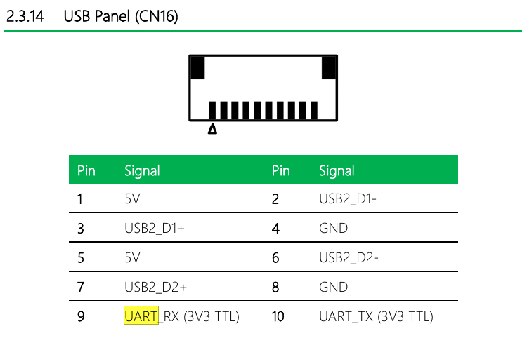
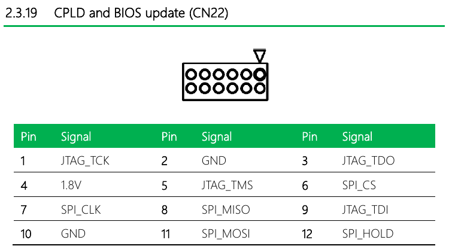

# Intel picocoder

This is a Raspberry Pi Pico firmware to perform voltage fault injection attacks
on Intel CPUs (Goldmont) microcode. It communicates with the target board via
UART0 (see [coreboot docs][coreboot-up-squared-doc]), and expects the target to
be red unlocked, and running the modified coreboot image that injects the
custom microcode at boot in ramstage.

Additionally, this firmware can be used as a generic SPI flash programmer using
the serprog protocol. The code to do so is pulled straight from
Tomas Roth's [pico-serprog](https://github.com/stacksmashing/pico-serprog).

## Voltage levels
Intel CPUs talk with external devices at 1.8V, and that includes both the
PMIC (over PMBus) and the BIOS EEPROM (over SPI). Additionally, the UART on the
UP Squared board is 3.3V.

The Pico runs at 3.3V by default, so you can either modify it to run at 1.8V
(see the RP2040 datasheet §2.9.7.3) or shift down PMBus and SPI. If you convert
the Pico to 1.8V, you will need to use a level shifter for the UART. TXS0102
and TXS0108 should work.

## Connections
### PMBus
-- TODO --

### UART ###
The UP Squared board has two UARTs: UART0 on the USB connector and UART1 on the
GPIO header. UART0 is easily available in coreboot with the red unlocked IFWI,
while UART1 does not seem to work, so that's what we're rolling with. :)

Get yourself a 10 pin JST connector with 1.0mm pitch and connect to `USB Panel
(CN16)` (see _UPSquared Maker Board UPS-APL User’s Manual 6th Ed_ § 2.3.14).
Also see [coreboot doc][coreboot-up-squared-doc]

__NOTE__: The UART on the UP Squared board is 3.3V, so you might need a level
shifter. See [Voltage levels](#voltage-levels).



Pico pinout as follows:

| GPIO | Pico Pin | Function |
|------|----------|----------|
| 0    | 1        | TX       |
| 1    | 2        | RX       |

### SPI Flasher
The Flash EEPROM on the UP Squared board is exposed through the
`CPLD and BIOS update (CN22)` header (see _UPSquared Maker Board UPS-APL User’s
Manual 6th Ed_ § 2.3.19).

__NOTE__: The EEPROM is 1.8V, so you need either a level shifter or to modify
the Pico to run at a lower voltage. See [Voltage levels](#voltage-levels).



Pico pinout as follows:

| GPIO | Pico Pin | Function |
|------|----------|----------|
| 22   | 29       | CS       |
| 26   | 31       | SCK      |
| 27   | 32       | MOSI     |
| 28   | 34       | MISO     |

## Building & Flashing
```bash
rm -rf build; (mkdir build && cd build && cmake ..)
(cd build && make && picotool load -f picocoder.uf2 && picotool reboot)
```

## Usage
TODO

See [pico-serprog][pico-serprog] readme for usage instructions as SPI flasher

[coreboot-up-squared-doc]: https://doc.coreboot.org/mainboard/up/squared/index.html
[pico-serprog]: https://github.com/stacksmashing/pico-serprog