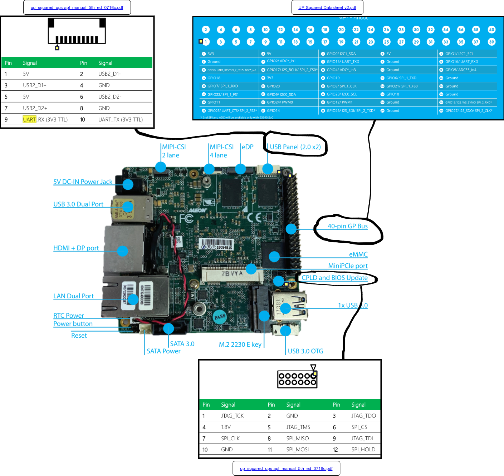
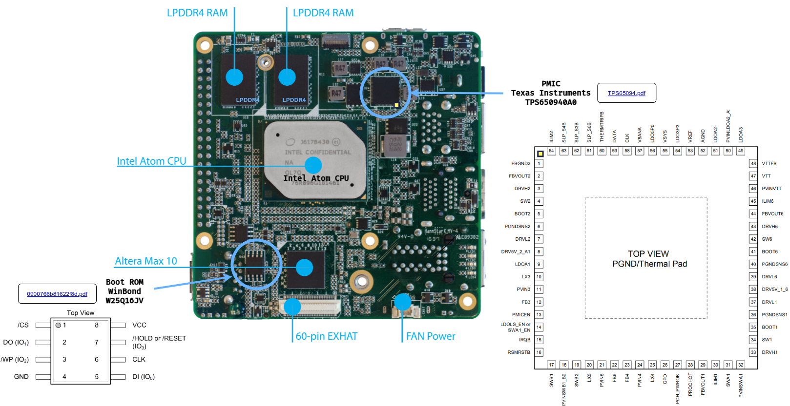
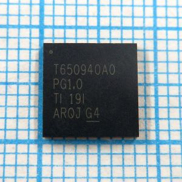
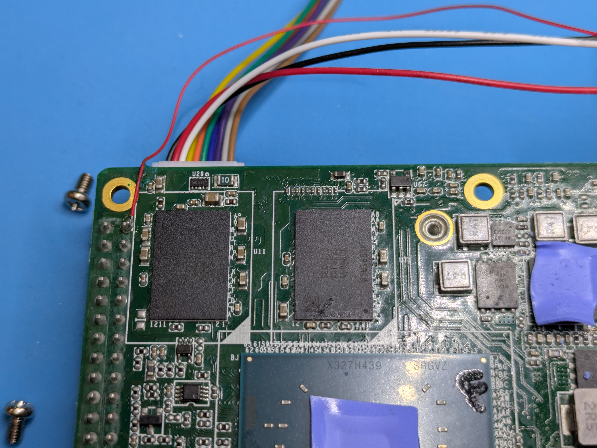
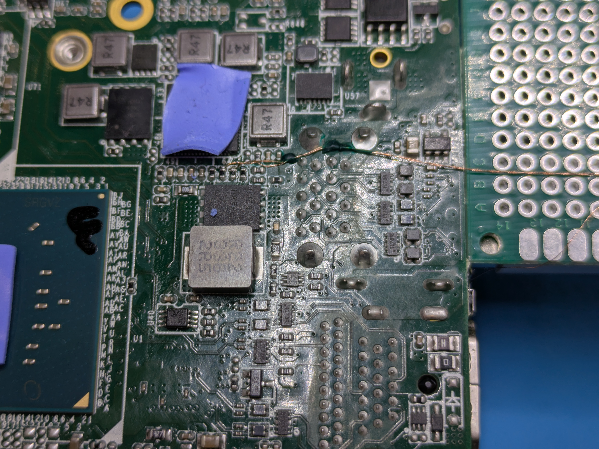
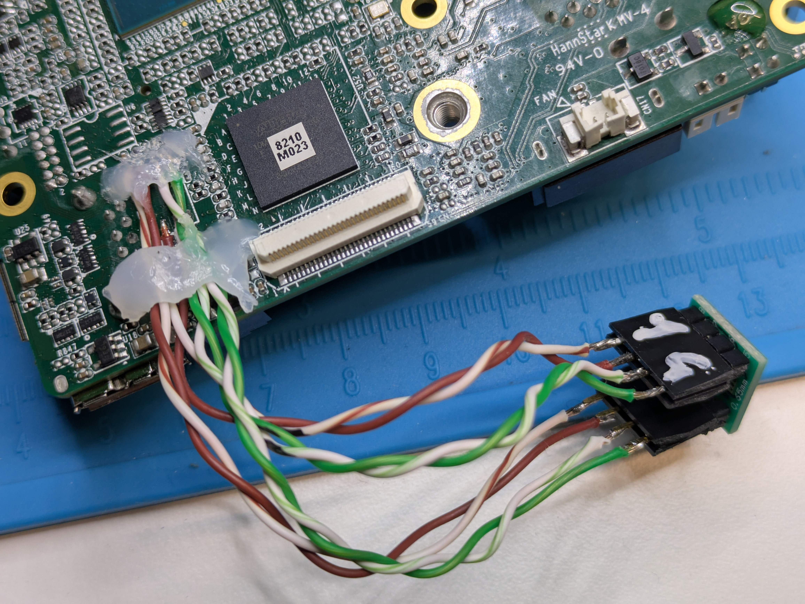
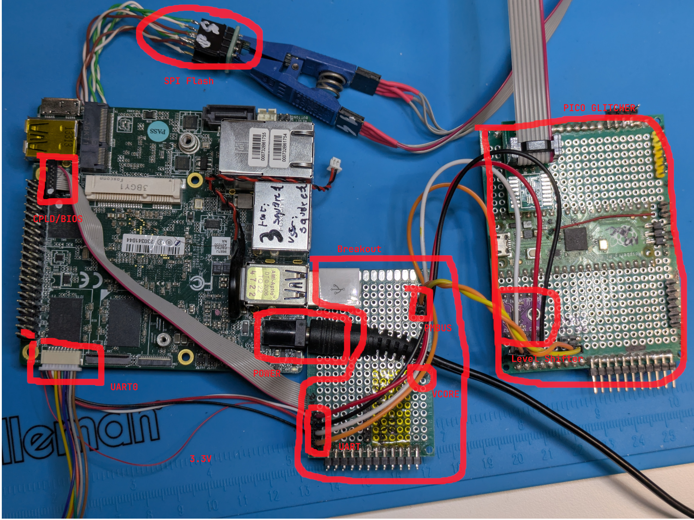

# UP Squared

Setup for the UP Squared board used as a target.

## Characteristics

- Coreboot support ([dedicated page](https://ceres-c.it/coreboot/mainboard/up/squared/index.html))
- Intel Pentium N4200 (Apollo Lake SoC, Goldmont microarch)

## Components

The board comes with a set of interfaces that we use to interact with the target, as well as an I2C PMIC which we hook to inject messages.


_Top view of the board, before modding (yellow squares indicate Pin 1)_


_Bottom view of the board, before modding (yellow squares indicate Pin 1)_

The relevant datasheets are:

- Mouser link of the exact board: https://www.mouser.it/ProductDetail/409-UPSAPLP4FA200432
- Board "Datasheet" (only high-level specs): https://up-board.org/wp-content/uploads/2021/06/UP-Squared-Datasheet-v2.pdf
- Board User Manual (including pinouts): https://up-shop.org/media/productattach/u/p/up_squared_ups-apl_manual_5th_ed_0716c.pdf

Two additional components which we found through reverse-engineering are:

- TPS65094 PMIC https://docs.rs-online.com/068a/0900766b81622f8d.pdf
  - 
- winbond W25Q16JV Flash https://www.recomb-omsk.ru/published/SC/html/scripts/doc/TPS65094.pdf

## Original BIOS

`upassw0rd` allows access to the original BIOS engineering menu, as stated in
the [docs](https://github.com/up-board/up-community/wiki/Firmware#engineering-bios-password).

### Original BIOS SPI/UART settings

See [here](https://github.com/up-board/up-community/wiki/Pinout_UP2#fpga) for
info on an interesting menu in the original bios where you can set which
SPI/UART port is enabled and their settings.

### Linux UART settings

```bash
stty 115200 < /dev/ttyS0
while true; do echo -ne A > /dev/ttyS0; done
```

## Modding

In order to prepare the board for glitching experiments, we connected a breakout board as follows:

- get UART0 TX/RX/GND (USB connector)
- get 3v3 from 40-pin connector (pin 1)
  - 
- get VCORE from accessible capacitor
  - 
- get PMBUS Data/CLK signals from PMIC
  - 

To flash the bootrom one can connect to the CPLD and BIOS connector.
As we observed that such solution was not always stable we opted for a more invasive solution: remove the EEPROM from the board and move it to a separate breakout where it can be directly accessed through a clip.



This is the final result. Note that the USB connector is only used to make the setup mechanically stable, and is not connected to any device.



## Misc Notes

### CTS/RTS

Additionally, UART CTS and RTS are available on connector CN7 (M.2 E-KEY).
These might enable more precise triggering through the UART software-managed flow
control, although we were not able to make them work.

### GPIO

GPIO goes through an Altera CPLD which acts as a level shifter[^1].
This requires a non-upstreamed driver. The source is available here:
[pinctrl-upboard](https://github.com/up-division/pinctrl-upboard).

_*Important*_: UART1 on the GPIOs work in coreboot if booting with the latest
IFWI image (not libmicro's). It might be that some sort of init is done there.

_Note/Idea_: Since this is just a level shifter? Can't I just use the GPIO
directly from the SoC soldering some wires to the CPLD?

[^1]: [Up Squared pinout doc](https://github.com/up-board/up-community/wiki/Pinout_UP2#fpga)
