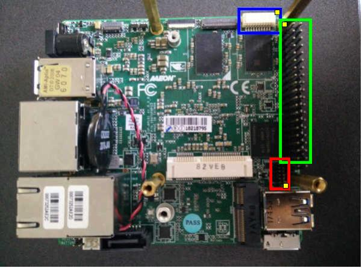

# UP Squared

### Coreboot
This board is supported by coreboot and has a [dedicated page](https://doc.coreboot.org/mainboard/up/squared/index.html).

### Interfaces
Both UART and SPI are available on the board

Image from [Coreboot docs](https://doc.coreboot.org/mainboard/up/squared/index.html)

- BLUE: UART0 / USB connector
- GREEN: UART1 / GPIO header
- RED: SPI header
- YELLOW: Indicates pin 1

The pinout can be found in the [User's Manual](./UP%20Squared%20(UPS-APL)%20Manual%206th%20Ed.pdf).

Additionally, UART CTS and RTS are available on connector CN7 (M.2 E-KEY).
Again, see datasheet for pinout. These are especially convenient because I
think I can use them for triggering exploiting the UART software-managed flow
control.

### Original BIOS engineering menu
`upassw0rd` allows access to the original BIOS engineering menu, as stated in
the [docs](https://github.com/up-board/up-community/wiki/Firmware#engineering-bios-password).

### GPIO
GPIO goes through an Altera CPLD and requires a non-upstreamed driver. The
source is available here: [pinctrl-upboard](https://github.com/up-division/pinctrl-upboard).